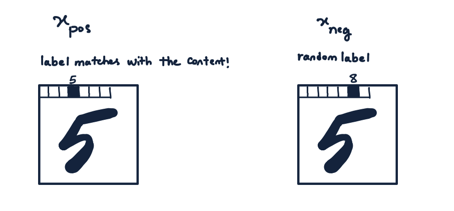

# Forward-Forward Alogrithm PyTorch

## Implementation of forward-forward (FF) training algorithm - an alternative to back-propagation

An implementation of Geoffrey Hinton's Forward-Forward Algorithm https://www.cs.toronto.edu/~hinton/FFA13.pdf


The local objective function is designed to push a layer's output to values larger than a threshold for positive samples and to values smaller than a threshold for negative samples.

A positive sample $s$ is a real datapoint with a large $P(s)$ under the training distribution.\
A negative sample $s'$ is a fake datapoint with a small $P(s')$ under the training distribution.


Among the many ways of generating the positive/negative samples, for MNIST, we have:\
Positive sample $s = merge(x, y)$, the image and its label\
Negative sample $s' = merge(x, y_{random})$, the image and a random label



After training all the layers, to make a prediction for a test image $x$, we find the pair $s = (x, y)$ for all $0 \leq y < 10$ that maximizes the network's overall activation.

```python
python ffMain.py
train error: 0.06554004915291748
test error: 0.06240002587273682
```